# Документация структуры таблиц и отношений базы данных

Эта документация описывает структуру таблиц и их взаимосвязи в базе данных PostgreSQL, используемой в проекте. Таблицы организованы для управления пользователями, миссиями, наградами, событиями, уровнями, рангами, навыками, покупками и другими сущностями. Для удобства восприятия информация представлена в виде таблиц и диаграмм связей.

schema.sql - полная структура


## Основные сущности

| Сущность | Описание |
|----------|----------|
| **users** | Хранит информацию о пользователях, включая их профили, роли, очки опыта, монеты и другие атрибуты. |
| **missions** | Миссии, которые пользователи могут выполнять для получения наград и очков. |
| **events** | События, в которых участвуют пользователи. |
| **rewards** | Награды, которые пользователи могут получить за миссии, ранги или покупки. |
| **skills** | Навыки пользователей, их прогресс и требования для миссий/рангов. |
| **ranks** | Ранги, которые пользователи могут достигать, основываясь на уровне и выполненных миссиях. |
| **levels** | Уровни пользователей, зависящие от накопленных очков опыта (XP). |
| **branches** | Ветви (группы или категории), к которым могут быть привязаны миссии и пользователи. |
| **shop_products** | Товары, доступные для покупки в магазине за монеты. |
| **logbook** | Журнал операций, фиксирующий изменения (покупки, миссии, награды, навыки и т.д.). |

## Перечисления (Enums)

Ниже приведены перечисления, используемые в таблицах для ограничения значений определённых полей.

| Перечисление | Значения |
|--------------|----------|
| **user_purchase_status** | `paid`, `fulfilled`, `refunded` |
| **user_gender** | `male`, `female` |
| **mission_type** | `start`, `take_photo_video`, `gallery_photo_video`, `file`, `quiz`, `questionnaire` |
| **user_reward_source** | `mission`, `shop`, `event`, `admin` |
| **event_status** | `pending`, `in_progress`, `completed`, `moderation` |
| **user_mission_status** | `pending`, `completed`, `failed` |
| **logbook_entity_type** | `purchase`, `mission`, `reward`, `skill`, `rank`, `level`, `event` |
| **global_role** | `candidate`, `employee`, `all` |
| **user_role** | `candidate`, `employee`, `admin`, `organizer`, `hr` |

## Таблицы и их структура

### 1. users
Хранит данные о пользователях системы.

| Поле | Тип | Описание |
|------|-----|----------|
| id | uuid | Уникальный идентификатор пользователя |
| created_at | timestamp with time zone | Дата и время создания записи |
| email | text | Электронная почта |
| xp_points | bigint | Очки опыта |
| first_name | text | Имя |
| last_name | text | Фамилия |
| level | bigint | Уровень пользователя |
| role | user_role | Роль пользователя |
| photo_url | text | URL фотографии |
| birth_date | date | Дата рождения |
| company_name | text | Название компании |
| company_position | text | Должность |
| company_start_date | timestamp with time zone | Дата начала работы в компании |
| skill_points | bigint | Очки навыков |
| coins | bigint | Монеты |
| rank_id | bigint | Ссылка на ранг (FK: ranks) |
| branch_id | bigint | Ссылка на ветвь (FK: branches) |
| gender | user_gender | Пол |
| nickname | text | Никнейм |
| city | text | Город |
| qualities | text | Качества |
| hobby | text | Хобби |
| training | text | Обучение |
| education | text | Образование |
| worked | text | Опыт работы |
| about_me | text | О себе |

**Триггеры:**
- `user_rank_update_trigger`: Срабатывает при обновлении уровня, проверяет возможность повышения ранга.
- `user_level_update_trigger`: Срабатывает при обновлении очков опыта, проверяет возможность повышения уровня.

### 2. missions
Хранит информацию о миссиях, которые могут выполнять пользователи.

| Поле | Тип | Описание |
|------|-----|----------|
| id | bigint | Уникальный идентификатор миссии |
| created_at | timestamp with time zone | Дата создания |
| title | text | Название миссии |
| description | text | Описание миссии |
| required_rank_id | bigint | Требуемый ранг (FK: ranks) |
| deadline_at | timestamp with time zone | Крайний срок выполнения |
| type | mission_type | Тип миссии |
| xp_points | bigint | Очки опыта за выполнение |
| coins | bigint | Монеты за выполнение |
| role | global_role | Роль, необходимая для миссии |
| task | text | Описание задачи |
| branch_id | bigint | Ссылка на ветвь (FK: branches) |
| order_index | bigint | Порядок сортировки |
| is_archived | boolean | Архивный статус |
| archived_at | timestamp with time zone | Дата архивации |
| content | jsonb | Дополнительные данные в формате JSON |
| auto_check_enabled | boolean | Включена ли автоматическая проверка |
| auto_check_function_name | text | Название функции автоматической проверки |

### 3. events
Хранит данные о событиях.

| Поле | Тип | Описание |
|------|-----|----------|
| id | bigint | Уникальный идентификатор события |
| created_at | timestamp with time zone | Дата создания |
| name | text | Название события |
| description | text | Описание события |
| is_completed | boolean | Завершено ли событие |
| status | event_status | Статус события |
| min_users | bigint | Минимальное количество участников |
| max_users | bigint | Максимальное количество участников |
| location | text | Место проведения |
| start_date | timestamp with time zone | Дата начала |
| user_id | uuid | Ссылка на организатора (FK: users) |
| image_proof_urls | text[] | URL изображений для подтверждения |
| video_proof_urls | text[] | URL видео для подтверждения |

### 4. levels
Хранит информацию об уровнях и необходимых очках опыта для их достижения.

| Поле | Тип | Описание |
|------|-----|----------|
| level | integer | Уровень |
| xp_to_next | integer | Очки опыта для следующего уровня |

**Ограничения:**
- `positive_xp_to_next`: Проверяет, что xp_to_next >= 0.

### 5. ranks
Хранит данные о рангах пользователей.

| Поле | Тип | Описание |
|------|-----|----------|
| id | bigint | Уникальный идентификатор ранга |
| title | text | Название ранга |
| order_index | bigint | Порядок сортировки |
| description | text | Описание ранга |
| character_video_male_url | text | URL видео для мужского персонажа |
| color | text | Цвет ранга |
| required_level | integer | Требуемый уровень (FK: levels) |
| badge_image_url | text | URL значка ранга |
| character_video_female_url | text | URL видео для женского персонажа |

### 6. skills
Хранит информацию о навыках.

| Поле | Тип | Описание |
|------|-----|----------|
| id | bigint | Уникальный идентификатор навыка |
| name | text | Название навыка |
| description | text | Описание навыка |
| image_url | text | URL изображения навыка |
| skill_max_points | numeric | Максимальное количество очков навыка |

### 7. rewards
Хранит данные о наградах.

| Поле | Тип | Описание |
|------|-----|----------|
| id | bigint | Уникальный идентификатор награды |
| name | text | Название награды |
| description | text | Описание награды |
| image_url | text | URL изображения награды |
| required_rank_id | bigint | Требуемый ранг (FK: ranks) |
| how_to_get | text | Как получить награду |
| rarity_id | bigint | Ссылка на редкость (FK: reward_rarities) |

### 8. shop_products
Хранит информацию о товарах в магазине.

| Поле | Тип | Описание |
|------|-----|----------|
| id | bigint | Уникальный идентификатор товара |
| created_at | timestamp with time zone | Дата создания |
| name | text | Название товара |
| description | text | Описание товара |
| price_coins | numeric | Стоимость в монетах |
| stock | bigint | Количество на складе |
| limit_per_user | bigint | Лимит покупок на пользователя |
| image_url | text | URL изображения товара |
| is_active | boolean | Активен ли товар |
| cateogry_id | bigint | Ссылка на категорию (FK: shop_categories) |

### 9. logbook
Журнал операций, фиксирующий изменения в системе.

| Поле | Тип | Описание |
|------|-----|----------|
| id | bigint | Уникальный идентификатор записи |
| created_at | timestamp with time zone | Дата создания |
| entity_id | bigint | ID связанной сущности |
| user_id | uuid | Ссылка на пользователя (FK: users) |
| entity_type | logbook_entity_type | Тип сущности |
| skill_points_change | bigint | Изменение очков навыков |
| xp_points_change | bigint | Изменение очков опыта |
| level_change | bigint | Изменение уровня |
| coins_change | bigint | Изменение монет |

**Индексы:**
- `idx_logbook_unique`: Уникальный индекс на основе user_id, entity_type и entity_id.

### 10. Связующие таблицы

#### mission_required_branches
Связывает миссии с требуемыми ветвями.

| Поле | Тип | Описание |
|------|-----|----------|
| id | bigint | Уникальный идентификатор |
| required_branch_id | bigint | Ссылка на ветвь (FK: branches) |
| mission_id | bigint | Ссылка на миссию (FK: missions) |

#### mission_required_missions
Связывает миссии с другими требуемыми миссиями.

| Поле | Тип | Описание |
|------|-----|----------|
| id | bigint | Уникальный идентификатор |
| mission_id | bigint | Ссылка на миссию (FK: missions) |
| required_mission_id | bigint | Ссылка на требуемую миссию (FK: missions) |

#### mission_required_skills
Связывает миссии с требуемыми навыками.

| Поле | Тип | Описание |
|------|-----|----------|
| id | bigint | Уникальный идентификатор |
| mission_id | bigint | Ссылка на миссию (FK: missions) |
| required_skill_id | bigint | Ссылка на навык (FK: skills) |
| required_skill_points | numeric | Требуемые очки навыка |

#### mission_rewards
Связывает миссии с наградами.

| Поле | Тип | Описание |
|------|-----|----------|
| id | bigint | Уникальный идентификатор |
| mission_id | bigint | Ссылка на миссию (FK: missions) |
| reward_id | bigint | Ссылка на награду (FK: rewards) |

#### mission_skills
Связывает миссии с навыками, которые можно получить.

| Поле | Тип | Описание |
|------|-----|----------|
| id | bigint | Уникальный идентификатор |
| mission_id | bigint | Ссылка на миссию (FK: missions) |
| skill_id | bigint | Ссылка на навык (FK: skills) |
| skill_up_points | numeric | Очки навыка за выполнение |

#### rank_required_missions
Связывает ранги с требуемыми миссиями.

| Поле | Тип | Описание |
|------|-----|----------|
| id | bigint | Уникальный идентификатор |
| rank_id | bigint | Ссылка на ранг (FK: ranks) |
| required_mission_id | bigint | Ссылка на миссию (FK: missions) |

#### rank_required_skills
Связывает ранги с требуемыми навыками.

| Поле | Тип | Описание |
|------|-----|----------|
| id | bigint | Уникальный идентификатор |
| rank_id | bigint | Ссылка на ранг (FK: ranks) |
| required_skill_id | bigint | Ссылка на навык (FK: skills) |
| required_skill_points | double precision | Требуемые очки навыка |

#### rank_rewards
Связывает ранги с наградами.

| Поле | Тип | Описание |
|------|-----|----------|
| id | bigint | Уникальный идентификатор |
| rank_id | bigint | Ссылка на ранг (FK: ranks) |
| reward_id | bigint | Ссылка на награду (FK: rewards) |

#### user_events
Связывает пользователей с событиями.

| Поле | Тип | Описание |
|------|-----|----------|
| id | bigint | Уникальный идентификатор |
| created_at | timestamp with time zone | Дата создания |
| user_id | uuid | Ссылка на пользователя (FK: users) |
| event_id | bigint | Ссылка на событие (FK: events) |

#### user_missions
Связывает пользователей с миссиями.

| Поле | Тип | Описание |
|------|-----|----------|
| id | bigint | Уникальный идентификатор |
| started_at | timestamp with time zone | Дата начала |
| competed_at | timestamp with time zone | Дата завершения |
| user_id | uuid | Ссылка на пользователя (FK: users) |
| mission_id | bigint | Ссылка на миссию (FK: missions) |
| playload | jsonb | Дополнительные данные |
| status | user_mission_status | Статус выполнения |

**Триггеры:**
- `mission_complete_trigger`: Срабатывает при завершении миссии (status = 'completed').

#### user_purchases
Хранит информацию о покупках пользователей.

| Поле | Тип | Описание |
|------|-----|----------|
| id | bigint | Уникальный идентификатор |
| created_at | timestamp with time zone | Дата создания |
| user_id | uuid | Ссылка на пользователя (FK: users) |
| price_coins | numeric | Стоимость в монетах |
| status | user_purchase_status | Статус покупки |
| shop_product_id | bigint | Ссылка на товар (FK: shop_products) |

#### user_rewards
Связывает пользователей с полученными наградами.

| Поле | Тип | Описание |
|------|-----|----------|
| id | bigint | Уникальный идентификатор |
| earned_at | timestamp with time zone | Дата получения |
| user_id | uuid | Ссылка на пользователя (FK: users) |
| reward_id | bigint | Ссылка на награду (FK: rewards) |
| source | user_reward_source | Источник награды |

#### user_skills
Связывает пользователей с их навыками.

| Поле | Тип | Описание |
|------|-----|----------|
| id | bigint | Уникальный идентификатор |
| updated_at | timestamp with time zone | Дата обновления |
| user_id | uuid | Ссылка на пользователя (FK: users) |
| skill_id | bigint | Ссылка на навык (FK: skills) |
| skill_points | numeric | Очки навыка |

### 11. reward_rarities
Хранит информацию о редкости наград.

| Поле | Тип | Описание |
|------|-----|----------|
| id | bigint | Уникальный идентификатор |
| name | text | Название редкости |
| color | text | Цвет редкости |
| info | text | Дополнительная информация |

### 12. shop_categories
Хранит категории товаров в магазине.

| Поле | Тип | Описание |
|------|-----|----------|
| id | bigint | Уникальный идентификатор |
| order_index | bigint | Порядок сортировки |
| name | text | Название категории |
| is_archived | boolean | Архивный статус |

## Диаграмма связей

```mermaid
erDiagram
    users ||--o{ user_missions : "участвует в"
    users ||--o{ user_rewards : "получает"
    users ||--o{ user_purchases : "совершает"
    users ||--o{ user_skills : "имеет"
    users ||--o{ user_events : "участвует в"
    users ||--o{ events : "организует"
    users ||--o{ ranks : "имеет ранг"
    users ||--o{ branches : "принадлежит к ветви"
    missions ||--o{ user_missions : "выполняется"
    missions ||--o{ mission_rewards : "дает награды"
    missions ||--o{ mission_skills : "дает навыки"
    missions ||--o{ mission_required_branches : "требует ветви"
    missions ||--o{ mission_required_missions : "требует миссии"
    missions ||--o{ mission_required_skills : "требует навыки"
    missions ||--o{ ranks : "требует ранг"
    missions ||--o{ branches : "принадлежит к ветви"
    ranks ||--o{ rank_rewards : "дает награды"
    ranks ||--o{ rank_required_missions : "требует миссии"
    ranks ||--o{ rank_required_skills : "требует навыки"
    ranks ||--o{ levels : "требует уровень"
    rewards ||--o{ user_rewards : "получается"
    rewards ||--o{ mission_rewards : "дается за миссию"
    rewards ||--o{ rank_rewards : "дается за ранг"
    rewards ||--o{ reward_rarities : "имеет редкость"
    skills ||--o{ user_skills : "принадлежит пользователю"
    skills ||--o{ mission_skills : "дается за миссию"
    skills ||--o{ mission_required_skills : "требуется для миссии"
    skills ||--o{ rank_required_skills : "требуется для ранга"
    events ||--o{ user_events : "имеет участников"
    shop_products ||--o{ user_purchases : "покупается"
    shop_products ||--o{ shop_categories : "принадлежит к категории"
    logbook ||--o{ users : "связан с пользователем"
```



## Дополнительные замечания

- **Триггеры**: Используются для автоматического обновления рангов и уровней пользователей, а также для обработки завершения миссий.
- **Ограничения целостности**: Внешние ключи настроены с действиями `CASCADE` или `SET NULL` для поддержания целостности данных при удалении или обновлении записей.
- **Индексы**: Уникальный индекс в таблице `logbook` обеспечивает уникальность записей по комбинации полей.
- **Перечисления**: Используются для строгого контроля значений в ключевых полях, таких как статусы и роли.
- **JSONB**: Поле `content` в таблице `missions` и `playload` в таблице `user_missions` позволяют хранить гибкие данные в формате JSON.

Эта структура базы данных поддерживает гибкую систему управления пользователями, миссиями, наградами и событиями, с акцентом на геймификацию и взаимодействие пользователей.


# Supabase — Установка на сервер

Инструкция по развёртыванию Supabase на собственном сервере (VPS/Dedicated). Основано на официальном руководстве [supabase/self-hosted](https://github.com/supabase/supabase).

## Требования

- Linux-сервер (Ubuntu/Debian/…).
- Docker `>= 20.10`.
- Docker Compose `>= 2.0`.
- Минимум: 4 GB RAM, 2 CPU, 20 GB SSD.
- Открытые порты: **80, 443** (и внутренние для сервисов).

## 1) Установка Docker и Docker Compose

```bash
# Обновляем пакеты
sudo apt-get update

# Устанавливаем Docker
curl -fsSL https://get.docker.com | sh

# Проверяем
docker --version

# Устанавливаем Docker Compose
sudo curl -L "https://github.com/docker/compose/releases/download/v2.24.6/docker-compose-$(uname -s)-$(uname -m)" -o /usr/local/bin/docker-compose
sudo chmod +x /usr/local/bin/docker-compose

# Проверяем
docker-compose --version
```

## 2) Клонирование репозитория Supabase

```bash
git clone https://github.com/supabase/supabase.git
cd supabase/docker
```

## 3) Создание .env файла

В корне папки `docker` создайте файл `.env`:

```bash
cp .env.example .env
```

Отредактируйте переменные:  
- `POSTGRES_PASSWORD` — пароль для базы данных  
- `JWT_SECRET` — секрет для токенов  
- `ANON_KEY`, `SERVICE_ROLE_KEY` — можно сгенерировать или использовать дефолтные  

## 4) Запуск контейнеров

```bash
docker-compose up -d
```

Проверить логи:
```bash
docker-compose logs -f
```

## 5) Доступ к сервисам

- API: `http://localhost:8000`
- Studio: `http://localhost:3000`
- Kong (reverse proxy): `http://localhost:8001`
- Postgres: `localhost:5432`

## 6) Остановка

```bash
docker-compose down
```

## 7) Обновление

```bash
git pull origin master
docker-compose pull
docker-compose up -d
```

---

Теперь Supabase развернут локально на сервере и готов к использованию.
